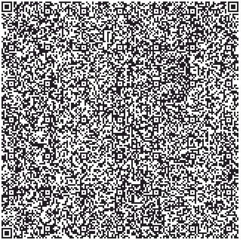

:Author: noaminsker
:Email:
:Date: 07/07/2021
:Revision: version#
:License: Public Domain
:imagesdir:

= Project: Let it Live

The project is about making sure your houseplant receives proper care. 
By placing our device/s in different plants around the house, collecting data about the sunlight and soil moisture, 
we can monitor these properties and alert the user when his plant needs some special care.

While Noa was house-sitting her friend’s house, she might have killed a plant or two. While it was a tragedy, an idea 
was born. If only there was something or someone who could tell her it is time to take care of the plants, many plant life would have been spared! 

Our implementation would place the (device) inside the plant’s pot, the devices would need to be connected to the house’s wifi network and connect remotely to a monitoring dashboard in the Arduino cloud. The user will physically set the size/type of plant the device is placed in, and immediately the data would stream to the cloud.

== Step 1: Installation

1. Create a new thing in you Arduino IoT cloud (or two, but this implementation currently only supports up to 2 devices)
2. Add the variables found in thingProperties.h (inside the initProperties() function).
3. If an arduino dashboard is desired-
   I)  Go to the dashboard tab and create a new dashboard.
   II) Choose ADD -> Widgets and for each device add the widgets "Percentage" linked to humidity & moistPrecentage, "Guage" linked to temperature 
       and "Chart" for each of the "average_" variables, and arrange as you desire.
4. If you want to use a Blynk app:
   I)  Install "Blynk(legacy)" from appStore / Google store.
   II) Log in and choose the scan QR symbol and scan:

   III) In the ip address put an IP address of ypur server (Blynk server, local server or some stand alone server).
   IV)  Copy the auth code of the app and paste where the code says so. Also write the same IP you used to log in the project.

=== Folder structure

....
 sketch123                => Arduino sketch folder
  ├── sketch123.ino       => main Arduino file
  ├── schematics.png      => (optional) an image of the required schematics
  ├── layout.png          => (optional) an image of the layout
  └── ReadMe.adoc         => this file
....

=== License
This project is released under a {License} License.

=== Contributing
To contribute to this project please contact: 

=== BOM
Add the bill of the materials you need for this project.

|===
| ID | Part name      | Part number | Quantity
| R1 | 10k Resistor   | 1234-abcd   | 10       
| L1 | Red LED        | 2345-asdf   | 5        
| A1 | Arduino Zero   | ABX00066    | 1        
|===

=== Help
This document is written in the _AsciiDoc_ format, a markup language to describe documents. 
If you need help you can search the http://www.methods.co.nz/asciidoc[AsciiDoc homepage]
or consult the http://powerman.name/doc/asciidoc[AsciiDoc cheatsheet]
